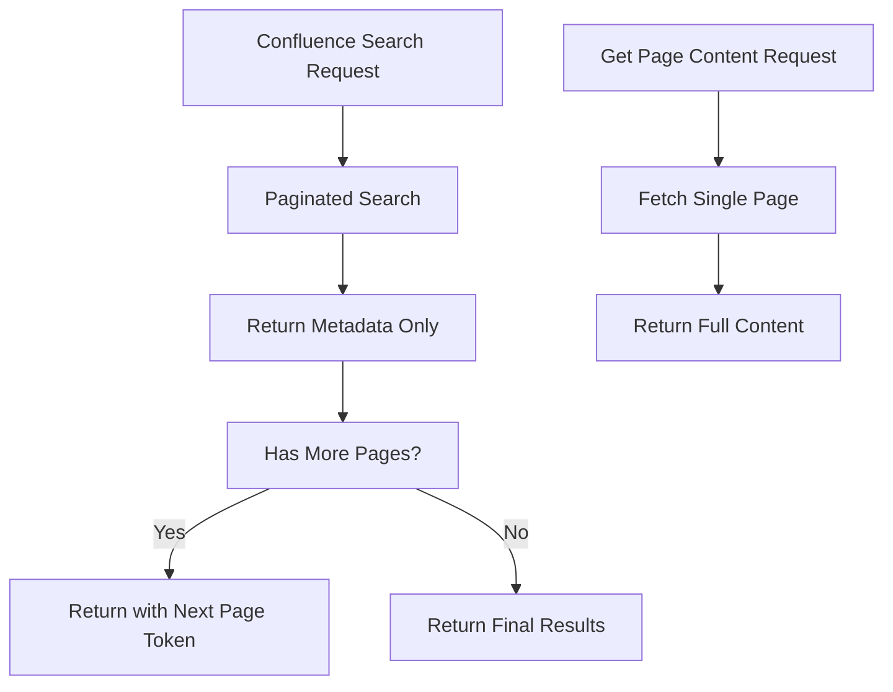

# Confluence Search Improvement Plan

## Problem Statement

The current Confluence search implementation has several limitations:

1. Responses can exceed maximum length limits when searching through large numbers of pages
2. No enforced pagination at the MCP server level
3. Fetching full content (body.storage) for all pages simultaneously increases response size
4. Limited control over result set size and content retrieval

## Solution Overview

The solution implements a paginated approach with separate content fetching:



## Technical Specifications

### 1. Modified Search Interface

```typescript
interface PaginatedSearchResponse {
  results: Array<{
    id: string;
    title: string;
    space: { key: string; name: string };
    _links: { webui: string };
    excerpt: string;
    lastModified: string;
  }>;
  metadata: {
    start: number;
    limit: number;
    totalSize: number;
    hasNext: boolean;
    nextPageStart?: number;
  };
}
```

### 2. New MCP Tools

#### confluence_search_pages
- **Purpose**: Returns paginated search results with metadata only
- **Parameters**:
  - query: string (required)
  - spaceKey?: string
  - start?: number
  - limit?: number (default: 25)
- **Response**: PaginatedSearchResponse

#### confluence_get_page_content
- **Purpose**: Fetches full content for a single page
- **Parameters**:
  - pageId: string (required)
- **Response**: Full page content including body.storage

#### confluence_bulk_get_pages
- **Purpose**: Batch fetching of multiple pages
- **Parameters**:
  - pageIds: string[] (required, max 10 pages)
- **Response**: Array of page content

### 3. Default Settings

- Page size: 25 items per request
- Excluded from initial search: body.storage
- Included metadata:
  - Page ID
  - Title
  - Space information
  - Web UI link
  - Content excerpt
  - Last modified date

## Implementation Steps

1. **ConfluenceClient Updates**
   - Modify searchPages method to handle pagination
   - Add new methods for single and bulk page content fetching
   - Implement response size optimization

2. **MCP Server Changes**
   - Update tool definitions
   - Implement new content fetching tools
   - Add pagination metadata handling
   - Implement response size checks

3. **Error Handling**
   - Add specific error types for:
     - Maximum page limit exceeded
     - Invalid pagination parameters
     - Content fetch failures
   - Implement retry logic for failed requests

4. **Performance Optimizations**
   - Cache frequently accessed page metadata
   - Implement request debouncing
   - Add request timeouts

## Testing Recommendations

1. **Unit Tests**
   - Test pagination logic
   - Verify metadata extraction
   - Validate error handling
   - Check parameter validation

2. **Integration Tests**
   - Test with large result sets
   - Verify content fetching
   - Test error scenarios
   - Check pagination flow

3. **Performance Tests**
   - Measure response times
   - Monitor memory usage
   - Test concurrent requests
   - Verify caching behavior

## Success Criteria

1. Response size stays within limits
2. Consistent response times
3. Accurate pagination
4. Proper error handling
5. Improved memory usage

## Future Considerations

1. Implement cursor-based pagination
2. Add result sorting options
3. Enhance caching mechanisms
4. Add content filtering options