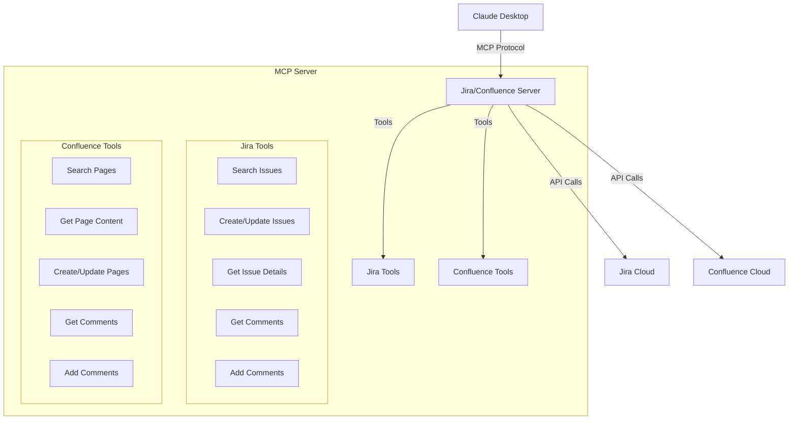

# Jira/Confluence MCP Server Implementation Plan

## Overview
This document outlines the implementation plan for creating an MCP server that integrates with Jira and Confluence Cloud APIs, allowing Claude Desktop to interact with these systems seamlessly.

## Architecture

## Implementation Steps

### 1. Project Setup
- Initialize new TypeScript project using MCP SDK
- Configure TypeScript compiler and project settings
- Add necessary dependencies:
  - @modelcontextprotocol/sdk
  - axios for API requests
  - jest for testing
  - typescript and related dev dependencies
- Setup environment variables handling for:
  - Jira Cloud API token
  - Confluence Cloud API token
  - Base URLs for Jira and Confluence instances

### 2. Core Infrastructure
- Create base API client classes
  - JiraApiClient class for Jira Cloud API interactions
  - ConfluenceApiClient class for Confluence Cloud API interactions
- Implement shared functionality:
  - Authentication header management
  - Rate limiting logic
  - Request/response logging
  - Error handling and custom error types
  - Response caching mechanism
  - Retry logic for failed requests

### 3. Jira Tools Implementation
- Search Issues Tool
  - Full-text search across issues
  - Filter support (project, type, status, etc.)
  - Sort options
  - Pagination handling
- Issue Operations Tools
  - Create new issues
  - Update existing issues
  - Get detailed issue information
  - Transition issue status
- Comments Tools
  - Fetch issue comments
  - Add new comments
  - Update existing comments
- Attachments Tools
  - Get issue attachments
  - Add new attachments
  - Download attachments

### 4. Confluence Tools Implementation
- Search Pages Tool
  - Full-text search across spaces
  - Filter by space, label, etc.
  - Sort options
  - Pagination handling
- Page Operations Tools
  - Get page content (with HTML to text conversion)
  - Create new pages
  - Update existing pages
  - Move pages
- Comments Tools
  - Fetch page comments
  - Add new comments
  - Update existing comments
- Attachments Tools
  - Get page attachments
  - Add new attachments
  - Download attachments

### 5. Resource Templates
- Jira Resources
  - Issue template: `jira://issue/{issueKey}`
  - Search template: `jira://search/{query}`
  - Comments template: `jira://issue/{issueKey}/comments`
  - Attachments template: `jira://issue/{issueKey}/attachments`
- Confluence Resources
  - Page template: `confluence://page/{pageId}`
  - Search template: `confluence://search/{query}`
  - Comments template: `confluence://page/{pageId}/comments`
  - Attachments template: `confluence://page/{pageId}/attachments`

### 6. Integration & Testing
- Unit Tests
  - Test all API client methods
  - Test tools functionality
  - Test resource handlers
  - Mock API responses
- Integration Tests
  - End-to-end testing with actual API calls
  - Error handling verification
  - Rate limiting tests
  - Cache functionality tests
- System Tests
  - Claude Desktop integration testing
  - Performance testing
  - Load testing

### 7. Documentation
- API Documentation
  - Document all available tools
  - Document resource templates
  - Include usage examples
- Setup Guide
  - Installation instructions
  - Configuration steps
  - Environment variables setup
- Troubleshooting Guide
  - Common issues and solutions
  - Error message explanations
  - Debugging tips

### 8. Configuration & Deployment
- Create configuration file structure
  - Server settings
  - API endpoints
  - Rate limiting settings
  - Cache settings
- Claude Desktop Integration
  - Add server to MCP settings
  - Configure default permissions
  - Setup auto-start options
- Deployment Documentation
  - System requirements
  - Installation steps
  - Update procedures
  - Backup recommendations

## Next Steps
1. Set up the project structure
2. Implement core infrastructure
3. Begin implementing Jira tools
4. Add Confluence tools
5. Add tests and documentation
6. Deploy and integrate with Claude Desktop